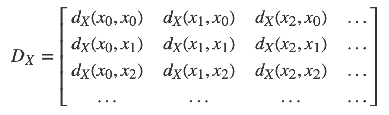

- ### Papers
- 
  collapsed:: true
	- author : [[Mukund Sundararajan]]
	  type : [[paper]]
	  tags : [[Explainable AI]] [[Computer Vision]] [[Convolutional Neural Networks]] [[Natural Language Processing]] [[Visualization]] [[Integrated Gradients]] [[Sensitivity]]
- 
  collapsed:: true
	- author : [[Karen Simonyan]]
	  type : [[paper]]
	  tags : [[Explainable AI]] [[Computer Vision]] [[Convolutional Neural Networks]] [[Visualization]] [[Saliency Map]] [[ImageNet]] [[Segmentation]] [[Deconv Nets]]
	- **Key Insights**:
	  collapsed:: true
		- To generate an image that maximizes the output of a class, simply freeze the hidden layers and let backpropagation adjust the input image.
		- To generate the saliency map, use backpropagation to generate the Jacobian matrix (derivatives) leading up the input image.  The Jacobian matrix is the saliency map for that particular image.
		- Using the Jacobian matrix, it is possible to perform automatic segmentation of objects within an image.
- 
  collapsed:: true
	- author : [[Matthew Zeiler]] 
	  type : [[paper]]
	  tags : [[Explainable AI]] [[Computer Vision]] [[Convolutional Neural Networks]] [[Visualization]] [[ImageNet]] [[Deconv Nets]]
	- **Key Insights:**
	  collapsed:: true
		- Using a deconv net it is possible to backpropagate back to the original image and identify what a hidden layer was focused on.
		- In this paper a decov net is a method that performs:
			- 1. max unpooling
			- 2. unRectified Linear Function
			- 3. unconvolution $F^{T}$
		- The backpropagated image as well as the original image are shown side by side to help the reader visualize what is going on.
-
- ### Websites
- [Building Blocks for Explainable AI](https://distill.pub/2018/building-blocks/)
	- author : [[Chris Olah]]
	  type : [[website]] 
	  tags : [[Computer Vision]] [[Convolutional Neural Networks]] [[Visualization]]
- [Understanding RL Vision](https://distill.pub/2020/understanding-rl-vision/)
	- author : [[Chris Olah]] 
	  type : [[website]] 
	  tags : [[Reinforcement Learning]] [[Computer Vision]] [[Convolutional Neural Networks]] [[Visualization]]
- [Visualizing Representations](http://colah.github.io/posts/2015-01-Visualizing-Representations/)
	- author : [[Chris Olah]] 
	  type : [[website]] 
	  tags : [[Convolutional Neural Networks]] [[Visualization]]
	- **Key Insights:**
	  collapsed:: true
		- Step 1) Train a bunch of different neural networks to do the same thing.
		- Step 2) Retrieve the high-dimensional representations of a series of inputs in the hidden layers of those neural networks.
		- Step 3a) Apply t-SNE to the representations in a given network, generating a low-dimensional visualization of how similar the representation of each of the inputs is to one-another. This is what you'd call "regular t-SNE".
		- OR:
		- Step 3b) Find the distance matrix for all the representations from a given network. Convert it to a vector, and think of it as a high-dimensional representation of the the network itself. Then, with all the distance vectors for all the networks from step 1, use t-SNE to generate a low-dimensional embedding of the networks themselves. This is meta-SNE, since you're embedding the networks based on their entire set of representations rather than embedding the specific representations of inputs in a particular network.
		- {:height 143, :width 368}
		- $D_{X}$ represents the relative distances of all embeddings to other embeddings of the neural network.  This can be transformed into a vector which we can use as meta-tsne
	-
-
- ### Code
- [Integrated Gradients](https://github.com/ankurtaly/Integrated-Gradients)
- [Grad-CAM: Gradient-weighted Class Activation Mapping](https://github.com/ramprs/grad-cam/)
- [Understanding RL Vision (Code)](https://colab.research.google.com/github/tensorflow/lucid/blob/master/notebooks/misc/rl_util.ipynb)
-