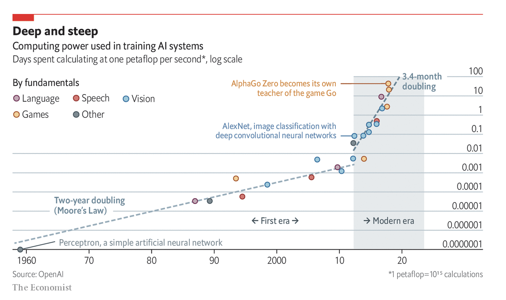
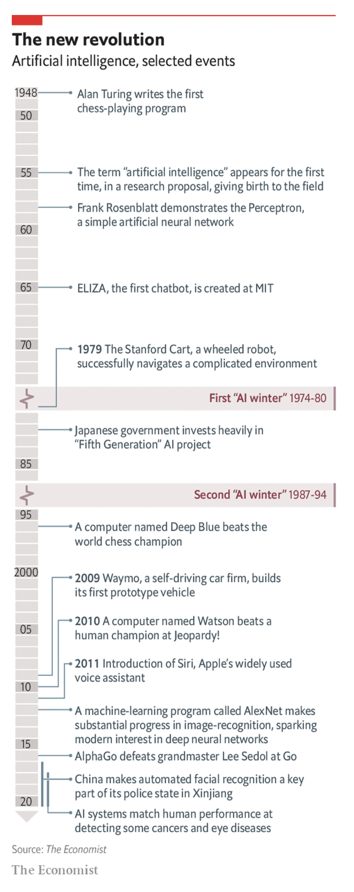
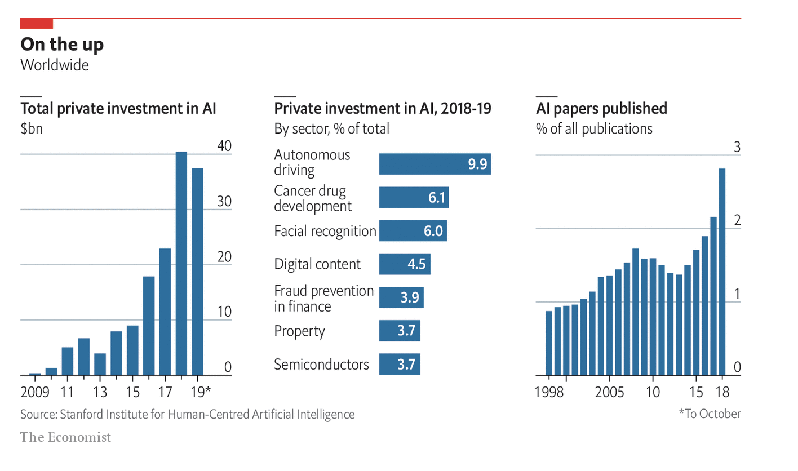
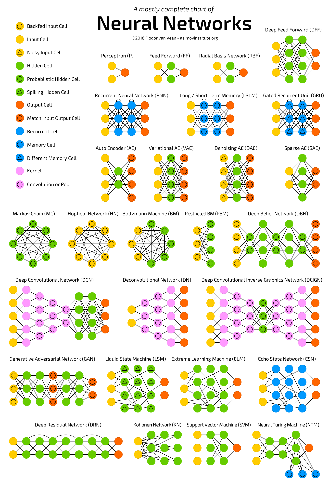

- # Overview
- # Books
	- [[Books]]
	- [[Books]]
	- [[Books]]
- # Computer Vision
	- [[Capsule Networks]]
	- [[Convolutional]]
	- [[Datasets]]
	- [[Diffusion]]
	- [[Generative Adversarial Networks]]
	- [[Representation]]
- # Natural Language
	- [[Natural Language Processing]]
- # History
  collapsed:: true
	- 
	- {:height 970, :width 482}
	- 
	-
- # Cheat Sheets
  collapsed:: true
	- 
	- 
	- 
	- 
	- 
	- 
	- 
- # Libraries
	-  [[Ray]]
-